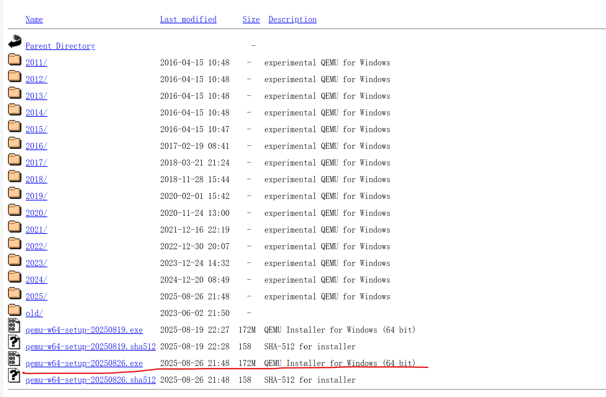
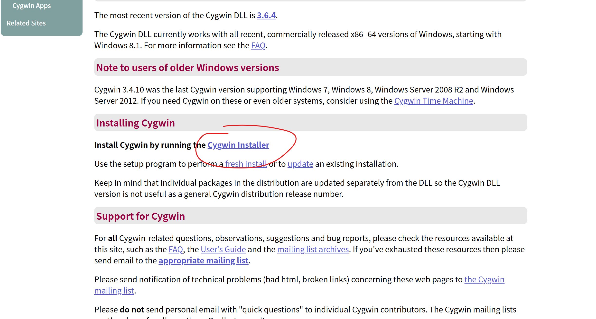
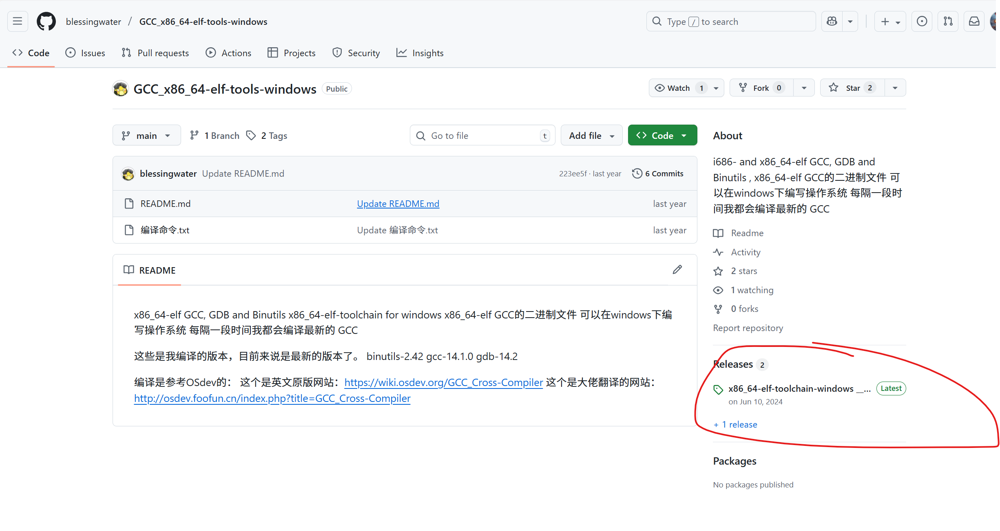
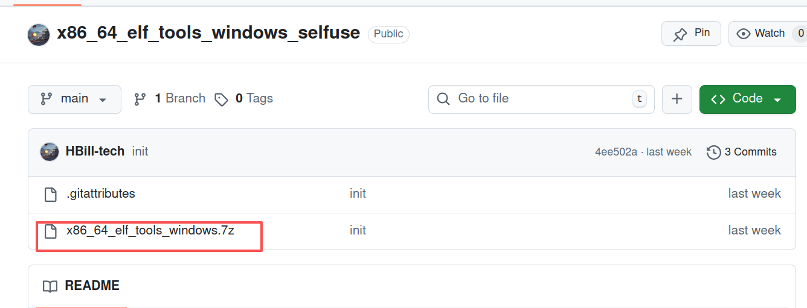
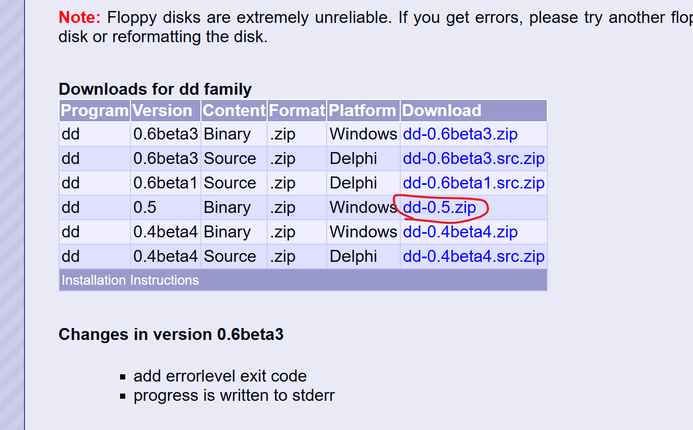
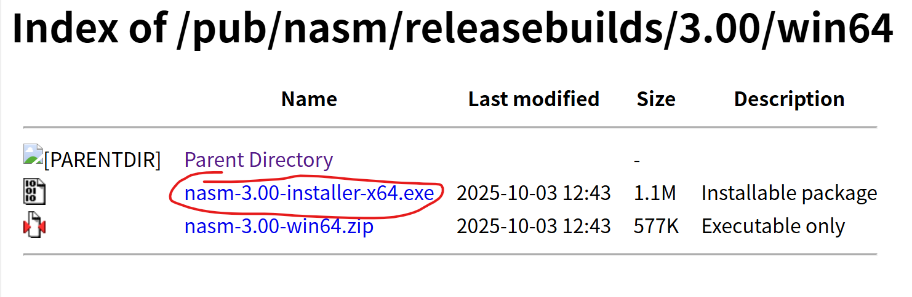
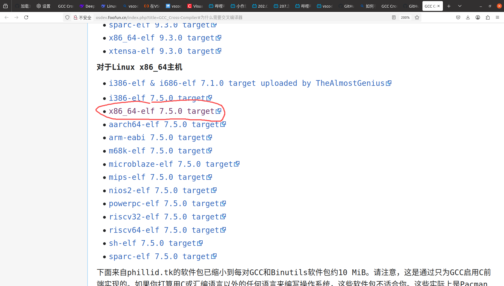
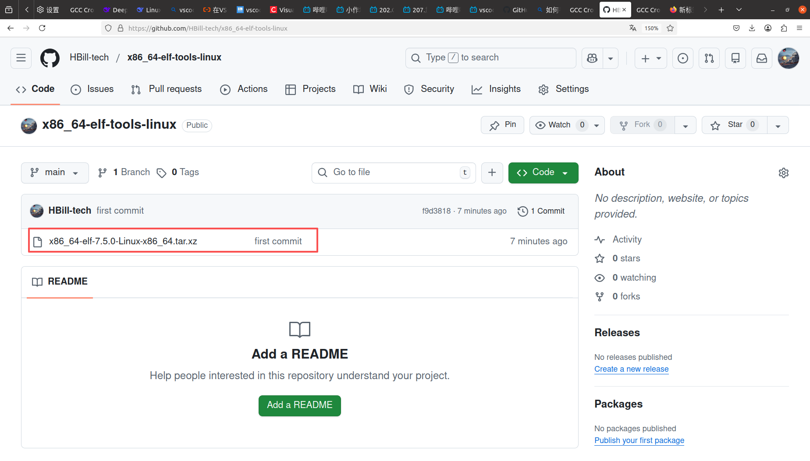

## 项目简介
* 复现`bilibili`教程[点击此处跳转](https://www.bilibili.com/video/BV1Xdpze7E7b?spm_id_from=333.788.videopod.sections&vd_source=0297a102b9c9dd5de04074dc53d40c26).
* 在windows环境下进行开发，对不熟悉linux的同志比较友好.

## Windows 运行环境配置

* Windows 11

### 虚拟机
**1.qemu**
* 该项目主要使用qemu，本项目使用的版本是`20250826`发布的.
* 下载链接: https://qemu.weilnetz.de/w64/
进入之后点击下图所示链接


下载好后，选择一个目录安装。假设选择了`D:\qemu`，那么要把`D:\qemu`加入到环境变量中.

**2.bochs**
* 用于部分的底层调试，本项目使用了2.8版本的
* 下载链接: https://sourceforge.net/projects/bochs/files/bochs/
* 运行setup程序时需要选定下载目录，假设目录是`D:\bochs`，要把`D:\bochs`加入到环境变量中.

### 其他工具
**1.CygWin**
CygWin下载目录 https://cygwin.com/

进入官网之后点击下图所示的"CygWin Installer"



在 CygWin 中安装的工具
* make 4.4.1
* gdb 14.2  &emsp; 这里的gdb不能连接到QEMU虚拟机，点击跳转到[解决办法](./doc/doc1.md)

注: CygWin安装好之后，记得将CygWin/bin添加到环境变量中，并且置于其他已安装的make和gdb的环境变量之前

**2.x86_64_elf_tools_windows**

[下载网址1](https://github.com/blessingwater/GCC_x86_64-elf-tools-windows?tab=readme-ov-file)

进入网址之后点击右侧的 release 版本下载



[下载网址2(github自用仓库)](https://github.com/HBill-tech/x86_64_elf_tools_windows_selfuse.git)

直接下载压缩包解压即可



下载好 `.zip/7z` 压缩包之后解压，将x86_64_elf_tools_windows/bin配置到环境变量中

**3.dd**
* 下载链接: http://www.chrysocome.net/dd
* 进入链接之后点击下图所示下载链接

下载得到一个.zip压缩包，解压到指定位置。假解压到`D:\dd`，则需要将`D:\dd`添加到环境变量中。


**4.nasm**
* 下载链接: https://www.nasm.us/pub/nasm/releasebuilds/3.00/win64/
* 进入链接之后点击 下图的链接

* 假设运行setup程序时选择的目录是`D:\nasm`，那么在下载完成之后要将`D:\nasm`添加到环境变量中.


## Ubuntu Linux 运行环境配置

* Ubuntu 20.04

### 1.nasm
```bash
sudo apt install nasm
```

### 2.make
```bash
sudo apt install make
```

### 3.dd
```bash
sudo apt install bash
```

### 4.x86_64_elf_tools

[下载链接1](http://osdev.foofun.cn/index.php?title=GCC_Cross-Compiler#%E4%B8%BA%E4%BB%80%E4%B9%88%E9%9C%80%E8%A6%81%E4%BA%A4%E5%8F%89%E7%BC%96%E8%AF%91%E5%99%A8)

进入链接后一直往下翻，快到底的时候能够看到下图的下载链接，点击下载即可。


[下载链接2](https://github.com/HBill-tech/x86_64-elf-tools-linux.git)


直接下载压缩包即可




将下载得到的压缩包解压到特定目录，比如 `usrname/programEnv/`，之后配置环境变量。
```bash
gedit ~/.bashrc

# bashrc 中写入以下命令
export PATH="usrname/programEnv/x86_64-elf-7.5.0-Linux-x86_64/bin:$PATH"

source ~/.bashrc
```

### 5.bochs
```bash
sudo apt install bochs
```

### 6.qemu
```bash
sudo apt install qemu-system-i386
```

### 7.gdb
系统一般自带，通过以下命令查看 `gdb` 的路径
```bash
whereis gdb
```
如果没有，则通过以下命令下载
```bash
sudo apt install gdb
```

## 启动命令

### 在QEMU上启动

```makefile
make qemu
```

### 在QEMU上启动且使用GDB调试

```makefile
make qemu-debug
```

### 在bochs上启动

```makefile
make bochs
```

## 问题解答文档入口

[gdb连接不上QEMU虚拟机](./doc/doc1.md)

[理解__asm__(.code16gcc);](./doc/doc2.md)

[关于跨平台开发磁盘镜像不兼容的Bug](./doc/doc3.md)

[时钟中断和实时时钟中断的区别](./doc/doc4.md)