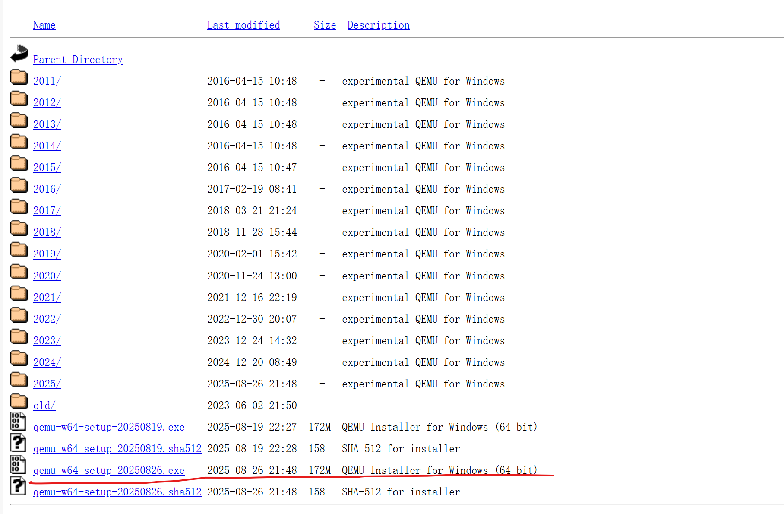
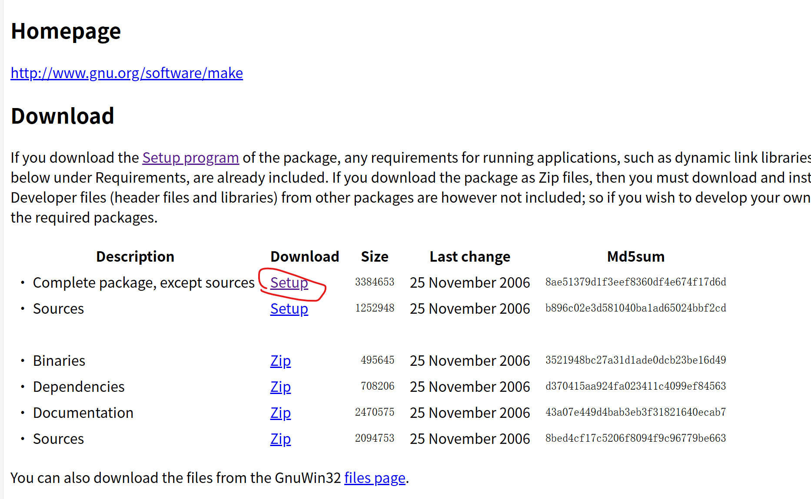
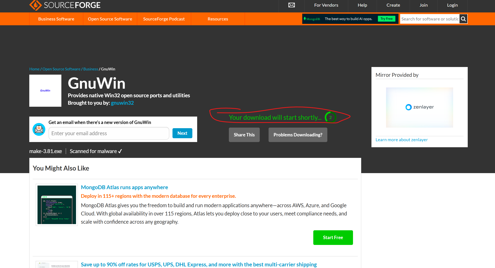
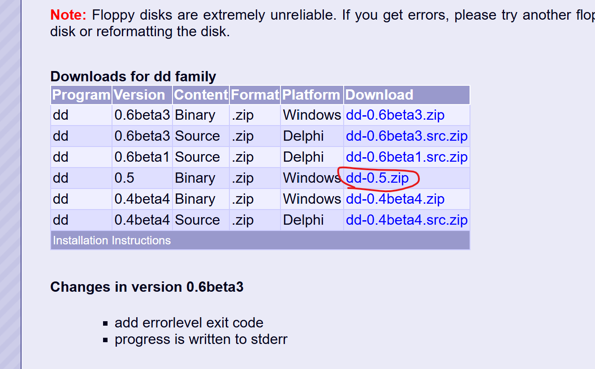
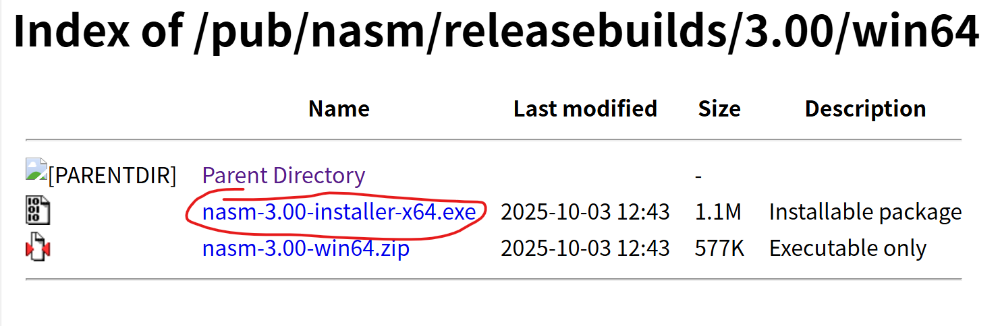

## 项目简介
* 复现`bilibili`教程[点击此处跳转](https://www.bilibili.com/video/BV1Xdpze7E7b?spm_id_from=333.788.videopod.sections&vd_source=0297a102b9c9dd5de04074dc53d40c26).
* 在windows环境下进行开发，对不熟悉linux的同志比较友好.

## Windows运行环境配置
#### 虚拟机
**1.qemu**
* 该项目主要使用qemu，本项目使用的版本是`20250826`发布的.
* 下载链接: https://qemu.weilnetz.de/w64/
进入之后点击下图所示链接


下载好后，选择一个目录安装。假设选择了`D:\qemu`，那么要把`D:\qemu`加入到环境变量中.

**2.bochs**
* 用于部分的底层调试，本项目使用了2.8版本的
* 下载链接: https://sourceforge.net/projects/bochs/files/bochs/
* 运行setup程序时需要选定下载目录，假设目录是`D:\bochs`，要把`D:\bochs`加入到环境变量中.

#### 其他工具
**1.make**
* 下载链接: https://gnuwin32.sourceforge.net/packages/make.htm
* 进入链接之后点击下图中的链接

之后会跳转到下图所示网页.

跳转后无需操作，只需等待，make的setup程序就会被下载.
* 假设运行setup程序的时候将make下载到了`D:\make`中，那么要将`D:\make`加入到环境变量中.
* 在cmd中运行 `make -v`，如果输出了make的版本号，说明安装成功.

**2.gdb**

参考以下文档: https://blog.csdn.net/ksws0292756/article/details/78505240

**3.dd**
* 下载链接: http://www.chrysocome.net/dd
* 进入链接之后点击下图所示下载链接

下载得到一个.zip压缩包，解压到指定位置。假解压到`D:\dd`，则需要将`D:\dd`添加到环境变量中。

**4.nasm**
* 下载链接: https://www.nasm.us/pub/nasm/releasebuilds/3.00/win64/
* 进入链接之后点击下图的链接

* 假设运行setup程序时选择的目录是`D:\nasm`，那么在下载完成之后要将`D:\nasm`添加到环境变量中.


## 运行命令

#### 在QEMU上启动

```makefile
make qemu
```

### 在bochs上启动

```makefile
make bochs
```

## Ubuntu运行环境配置

### 在QEMU上启动

```makefile
make qemu-linux
```