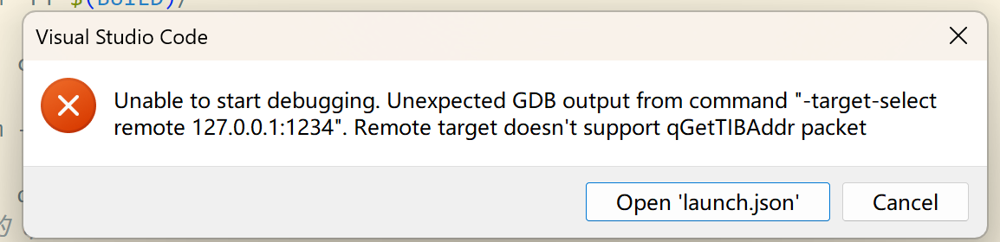

## gdb连接不上QEMU虚拟机

配置 gdb 出现如下问题

可能是因为CygWin中安装的gdb与qemu虚拟机的gdb stub不兼容，x86_64_elf_tools_windows中的x86_64-elf-gdb.exe可以使用。

配置launch文件，这里的miDebuggerPath改为x86_64_elf_tools_windows安装在电脑的位置
```
"miDebuggerPath": "D:/ProgramEnv/x86_64_elf_tools_windows/bin/x86_64-elf-gdb.exe",
```

[返回README](../README.md)